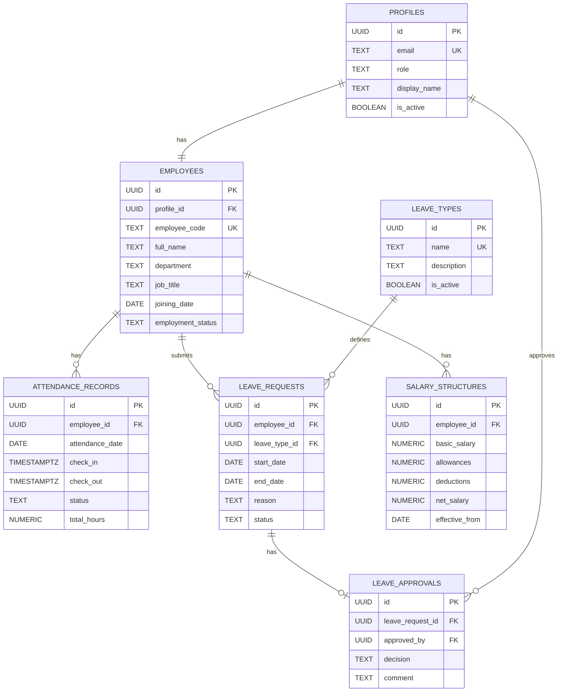

# Dayflow --- Human Resource Management System

> **Every workday, perfectly aligned.**

[](https://react.dev/)
[](https://www.typescriptlang.org/)
[](https://vite.dev/)
[](https://supabase.com/)
[](https://tailwindcss.com/)
[](LICENSE)

Dayflow is a modern Human Resource Management System (HRMS) built for
the **Odoo × NMIT Bangalore Hackathon 2026**. It brings employee
management, attendance, leave workflows, salary visibility, role-based
access, and HR operations into one focused web application.

------------------------------------------------------------------------

## ✨ Overview

Traditional HR workflows often spread employee information across
spreadsheets, attendance registers, messages, and manual approval
processes. Dayflow is designed to bring these workflows together in a
single system with separate experiences for **Employees** and **Admins /
HR Officers**.

The project follows the functional requirements defined for Dayflow:

-   Secure authentication and authorization
-   Employee profile management
-   Daily and weekly attendance tracking
-   Check-in / check-out
-   Leave and time-off requests
-   Admin approval workflows
-   Salary and payroll visibility
-   Role-based access control
-   Database-level authorization using Supabase Row Level Security

------------------------------------------------------------------------

## 🎯 Core Features

### 👤 Employee Management

-   Employee directory with search and filtering
-   Employee profiles
-   Personal and job information
-   Profile picture support
-   Admin-controlled employee records
-   Employee self-service profile updates for permitted fields
-   Employee status management

### 🔐 Authentication & Authorization

-   Supabase Authentication
-   Sign in / sign up
-   Persistent sessions
-   Protected routes
-   Role-based routes
-   Employee and Admin access boundaries
-   Database-level authorization through PostgreSQL RLS

### ⏱️ Attendance

-   Daily attendance view
-   Monthly / employee attendance view
-   Check-in and check-out
-   Present, Absent, Half-day and Leave statuses
-   Working-day aware attendance calculations
-   Automatic total-hours calculation at database level

### 🏖️ Leave & Time-Off

-   Leave type management
-   Leave request creation
-   Date-range selection
-   Optional remarks
-   Pending / Approved / Rejected states
-   Admin approval and rejection
-   Approval comments
-   Approved leave reflected in attendance records

Initial P0 leave types:

-   Paid Leave
-   Sick Leave
-   Unpaid Leave
-   Casual Leave

### 💰 Payroll & Salary

-   Employee salary visibility
-   Admin salary management
-   Basic salary
-   Allowances
-   Deductions
-   Generated net salary
-   Effective salary dates
-   Salary overview for the organization

The database calculates `net_salary` instead of accepting it as a
manually supplied value.

### 📊 Dashboards & Reporting

-   Employee dashboard
-   Admin dashboard
-   Attendance statistics
-   Leave statistics
-   Employee counts
-   Recent activity
-   Salary overview
-   Recharts-based data visualization

------------------------------------------------------------------------

## 🏗️ Architecture

Dayflow uses a feature-oriented React architecture with Supabase as the
backend platform.

``` text
┌─────────────────────────────────────────────────────────┐
│                     Dayflow Web App                     │
│                 React + TypeScript + Vite               │
├─────────────────────────────────────────────────────────┤
│ UI Layer                                                │
│ ├── Pages                                               │
│ ├── Layouts                                             │
│ ├── shadcn/ui components                                │
│ └── Tailwind CSS                                        │
├─────────────────────────────────────────────────────────┤
│ Application Layer                                       │
│ ├── Feature services                                    │
│ ├── React Query hooks                                   │
│ ├── Validation / utilities                              │
│ └── Role-based routing                                  │
├─────────────────────────────────────────────────────────┤
│ Backend Integration                                     │
│ ├── Supabase Auth                                       │
│ ├── PostgreSQL                                          │
│ ├── Row Level Security                                  │
│ ├── RPC functions                                       │
│ └── Generated database values                           │
└─────────────────────────────────────────────────────────┘
```

### Current integration status

The repository contains both the production-oriented Supabase service
layer and a mature mock data layer used by several existing feature
hooks.

**Currently wired to Supabase:**

-   Authentication
-   Session management
-   Sign in / sign up
-   Auth-protected routing

**Service layer implemented but feature hooks/pages still using mock
data:**

-   Employee management
-   Attendance
-   Leave types
-   Leave requests
-   Leave approvals
-   Payroll
-   Dashboard data
-   Profile backend operations

This separation keeps the frontend demonstrable while the remaining
feature hooks are migrated to the live backend.

------------------------------------------------------------------------

## 🧰 Tech Stack

  Category           Technology
  ------------------ -----------------------------
  Frontend           React 19
  Language           TypeScript
  Build Tool         Vite
  Styling            Tailwind CSS
  Component System   shadcn/ui
  Routing            React Router
  Server State       TanStack Query
  Forms              React Hook Form
  Validation         Zod
  Charts             Recharts
  Animation          Framer Motion
  Icons              Lucide React
  Backend            Supabase
  Authentication     Supabase Auth
  Database           PostgreSQL
  Authorization      Supabase Row Level Security
  Package Manager    npm
  License            MIT

------------------------------------------------------------------------

## 🗂️ Project Structure

``` text
HRMS4ODOO/
├── docs/
│   └── odoo_context.md
├── public/
│   └── assets/
├── scripts/
│   └── test-attendance.ts
├── src/
│   ├── components/
│   │   ├── common/
│   │   └── ui/
│   ├── features/
│   │   ├── attendance/
│   │   ├── auth/
│   │   ├── employees/
│   │   ├── leave/
│   │   ├── notifications/
│   │   ├── payroll/
│   │   ├── profile/
│   │   └── reports/
│   ├── layouts/
│   ├── lib/
│   │   ├── mock/
│   │   ├── salary/
│   │   ├── supabase/
│   │   └── validations/
│   ├── pages/
│   │   ├── attendance/
│   │   ├── auth/
│   │   ├── dashboard/
│   │   ├── employee/
│   │   ├── employees/
│   │   ├── payroll/
│   │   ├── settings/
│   │   ├── shared/
│   │   └── time-off/
│   ├── routes/
│   ├── types/
│   ├── App.tsx
│   └── main.tsx
├── supabase/
│   ├── config.toml
│   ├── functions/
│   ├── migrations/
│   └── seed/
├── package.json
├── package-lock.json
├── vite.config.ts
└── README.md
```

------------------------------------------------------------------------

## 🗄️ Database Design

Dayflow's P0 database is a normalized **7-table PostgreSQL schema**
managed through Supabase.



### Tables

  Table                  Responsibility
  ---------------------- --------------------------------------------------
  `profiles`             Application user profile linked to Supabase Auth
  `employees`            HR and employee information
  `attendance_records`   Daily attendance and working hours
  `leave_types`          Leave category master data
  `leave_requests`       Employee leave applications
  `leave_approvals`      Final Admin decisions
  `salary_structures`    Salary components and effective salary

### Database safeguards

The schema uses:

-   UUID primary keys
-   Foreign keys
-   Unique constraints
-   CHECK constraints
-   Generated columns
-   Timezone-aware attendance timestamps
-   `updated_at` triggers
-   PostgreSQL functions / RPCs
-   Explicit foreign-key delete behavior
-   Supabase Row Level Security

Important generated values:

``` text
total_hours = checkout - checkin
net_salary = basic_salary + allowances - deductions
```

The database prevents negative net salary values.

------------------------------------------------------------------------

## 🔒 Security Model

Dayflow follows a defense-in-depth authorization model.

### Employee

Employees can access only their own:

-   Profile
-   Employee record
-   Attendance
-   Leave requests
-   Salary information

Employees cannot approve leave requests or manage organization-wide
employee data.

### Admin / HR

Admins can manage authorized organization-level:

-   Employees
-   Attendance
-   Leave requests
-   Leave approvals
-   Salary records
-   Leave types

### Row Level Security

RLS is enabled on all seven application tables.

Frontend role checks are **not** treated as the security boundary.
Authorization is enforced at the database layer using Supabase RLS and
`auth.uid()`.

------------------------------------------------------------------------

## 🔄 Leave Approval Workflow

``` text
Employee
   │
   │ Submit Leave Request
   ▼
Pending
   │
   ▼
Admin / HR Review
   │
   ├───────────────┐
   │               │
   ▼               ▼
Approved        Rejected
   │
   ▼
Create Approval Record
   │
   ▼
Update Attendance
for Leave Dates
```

The agreed P0 workflow is transactional:

1.  Employee submits a leave request.
2.  Request starts as `Pending`.
3.  Admin reviews the request.
4.  Admin approves or rejects it.
5.  An approval record is stored.
6.  Approved leave dates are reflected in attendance.
7.  The related changes are intended to succeed or fail together.

------------------------------------------------------------------------

## 🚀 Getting Started

### Prerequisites

Install:

-   Node.js 18+ recommended
-   npm
-   A Supabase project for live backend integration

### 1. Clone the repository

``` bash
git clone <your-repository-url>
cd HRMS4ODOO
```

### 2. Install dependencies

``` bash
npm install
```

### 3. Configure environment variables

Create a local `.env` file.

``` env
VITE_SUPABASE_URL=your_supabase_project_url
VITE_SUPABASE_PUBLISHABLE_KEY=your_supabase_publishable_key
```

> Never commit `.env`, Supabase secrets, service-role keys, or other
> credentials.

### 4. Start the development server

``` bash
npm run dev
```

### 5. Build for production

``` bash
npm run build
```

### 6. Preview the production build

``` bash
npm run preview
```

### 7. Run linting

``` bash
npm run lint
```

------------------------------------------------------------------------

## 🧪 Testing & Verification

The repository includes an attendance verification script:

``` text
scripts/test-attendance.ts
```

The backend is also structured around:

-   Typed domain models
-   Service-layer result handling
-   Database constraints
-   RLS policies
-   RPC-based privileged operations
-   React Query mutations and cache invalidation

For database verification, use the Supabase CLI against the intended
project rather than assuming that local migration files are deployed.

------------------------------------------------------------------------

## 🧭 Supabase Setup

The canonical P0 schema lives under:

``` text
supabase/migrations/
```

The primary Dayflow schema migration creates:

-   `profiles`
-   `employees`
-   `attendance_records`
-   `leave_types`
-   `leave_requests`
-   `leave_approvals`
-   `salary_structures`

The repository also contains RPCs for employee creation and leave
workflows.

### ⚠️ Migration note

The repository currently contains **legacy / additional migration
files** that redefine tables already created by the canonical Dayflow
schema.

Do **not** blindly run every SQL file in `supabase/migrations/` against
a fresh or existing database without first reconciling the migration
lineage.

The overlapping files are:

``` text
20250101000200_attendance_setup.sql
20250101000300_leave_types_setup.sql
20250101000400_leave_requests_setup.sql
20250101000500_salary_setup.sql
20250101000600_leave_approval_rpc.sql
```

The canonical Dayflow schema is represented by the `20260822...`
migration sequence.

Before another `supabase db push`, keep the migration set consistent so
that no table or policy is created twice.

------------------------------------------------------------------------

## 🧑‍💻 Development Guidelines

### Feature-first organization

When adding functionality, prefer:

``` text
src/features/<feature>/
src/pages/<feature>/
```

Keep:

-   UI components in pages/components
-   Backend access in feature services
-   React Query behavior in hooks
-   Validation schemas in `src/lib/validations`
-   Shared helpers in `src/lib`
-   Route definitions in `src/routes`

### Database changes

Treat the database schema as a contract.

Changes to:

-   Table structure
-   Column names
-   Relationships
-   Status values
-   Authorization boundaries
-   RPC contracts

should be coordinated before modifying migrations.

### Authentication

Use the existing Supabase-backed authentication services rather than
introducing another independent authentication flow.

### Security

Never rely solely on frontend route guards for authorization. Sensitive
operations must remain protected by Supabase RLS and database-level
authorization.

------------------------------------------------------------------------

## 📌 Current Project Status

  Area                                Status
  ----------------------------------- ------------------------------------------
  Product specification               Defined
  React application shell             Implemented
  Responsive UI                       Implemented
  Employee dashboard                  Implemented
  Admin dashboard                     Implemented
  Employee directory                  Implemented
  Profile UI                          Implemented
  Attendance UI                       Implemented
  Leave / time-off UI                 Implemented
  Payroll UI                          Implemented
  Supabase client                     Implemented
  Supabase Auth integration           Wired
  PostgreSQL schema                   Defined
  7-table schema deployment           Verified in project audit
  RLS                                 Defined and verified in project audit
  Feature services                    Implemented
 

> **Important:** "Implemented" does not always mean "fully connected to
> the live backend." Several feature pages currently use the
> repository's mock data layer while their corresponding Supabase
> services already exist.

------------------------------------------------------------------------

## 🛣️ Roadmap

### Phase 1 --- Core Platform

-   [x] React + TypeScript application
-   [x] Role-based application structure
-   [x] Employee and Admin dashboards
-   [x] Supabase client
-   [x] Supabase authentication

### Phase 2 --- HR Operations

-   [x] Employee management UI
-   [x] Attendance UI
-   [x] Leave management UI
-   [x] Payroll UI
-   [x] Profile management

### Phase 3 --- Backend Integration

-   [x] PostgreSQL schema
-   [x] RLS policies
-   [x] Supabase service layer
-   [ ] Connect employee hooks to Supabase
-   [ ] Connect attendance hooks to Supabase
-   [ ] Connect leave hooks to Supabase
-   [ ] Connect payroll hooks to Supabase
-   [ ] Connect dashboard queries to Supabase
-   [ ] Complete live end-to-end testing

### Phase 4 --- Future Enhancements

-   [ ] Email and notification alerts
-   [ ] Advanced analytics dashboard
-   [ ] Attendance reports
-   [ ] Salary slips / downloadable payroll reports
-   [ ] Broader HR automation

------------------------------------------------------------------------

## 📚 Project Documentation

### Functional Requirements

The Dayflow requirements cover:

-   Authentication
-   User roles
-   Dashboards
-   Employee profiles
-   Attendance
-   Leave management
-   Payroll / salary visibility
-   Future notifications and reporting

### Database Schema

The database schema reference documents the complete:

-   ER diagram
-   Table definitions
-   Foreign-key map
-   RLS model
-   Indexes
-   Generated columns
-   Leave approval workflow
-   Frozen P0 decisions

### Odoo / Hackathon Context

Additional project context is maintained in:

``` text
docs/odoo_context.md
```

### Architecture Diagram

The project architecture and product flow were documented using
Excalidraw.

[Open the Dayflow Excalidraw
architecture](https://link.excalidraw.com/l/65VNwvy7c4X/58RLEJ4oOwh)

------------------------------------------------------------------------

## 👥 Team

### Odoo × NMIT Bangalore Hackathon 2026

**Dayflow --- Human Resource Management System**

-   Saaheil Kalyani
-   Anant Bhatnagar
-   Nishant Kumar
-   Avanish Pandey

------------------------------------------------------------------------

## 🏆 Hackathon Context

Dayflow was developed for the **Odoo × NMIT Bangalore Hackathon 2026**
with the goal of building a practical, modern HRMS experience around
common employee and HR workflows.

The product focuses on making everyday HR operations:

-   simpler,
-   faster,
-   more transparent,
-   role-aware, and
-   easier to manage from a single interface.

------------------------------------------------------------------------

## 📄 License

This project is licensed under the MIT License.

See [LICENSE](LICENSE) for details.

------------------------------------------------------------------------

## ⭐ Acknowledgements

Built with:

-   React
-   TypeScript
-   Vite
-   Tailwind CSS
-   shadcn/ui
-   TanStack Query
-   Supabase
-   PostgreSQL
-   Recharts
-   Framer Motion
-   Lucide

------------------------------------------------------------------------

```{=html}
<p align="center">
```
`<strong>`{=html}Dayflow`</strong>`{=html}`<br />`{=html} Every workday,
perfectly aligned.
```{=html}
</p>
```
